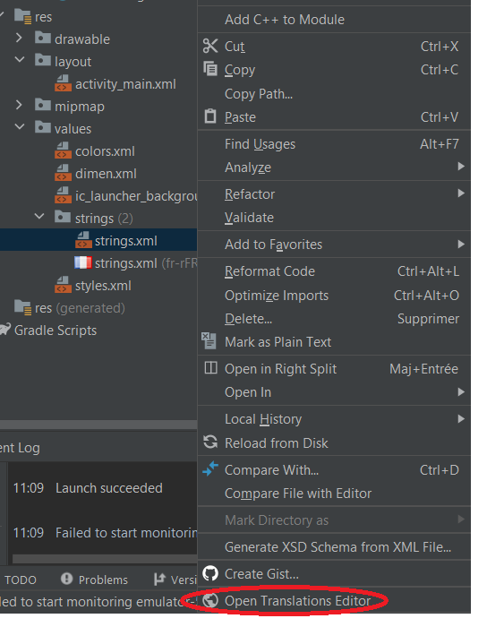
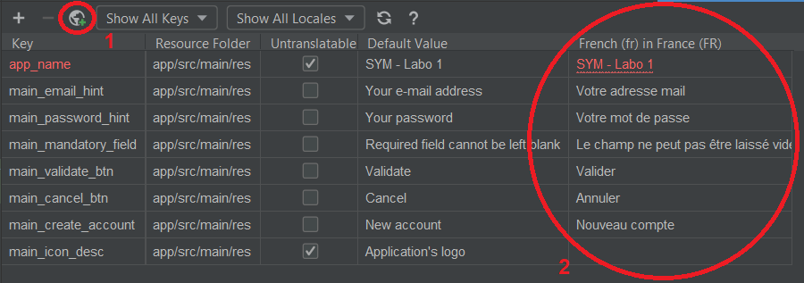
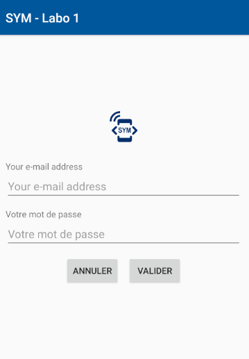
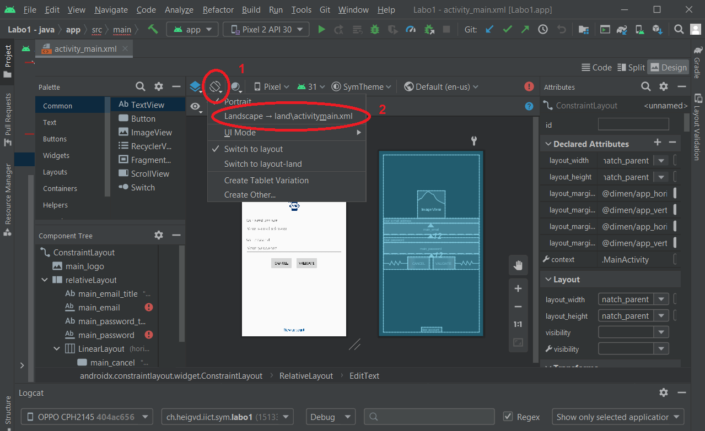
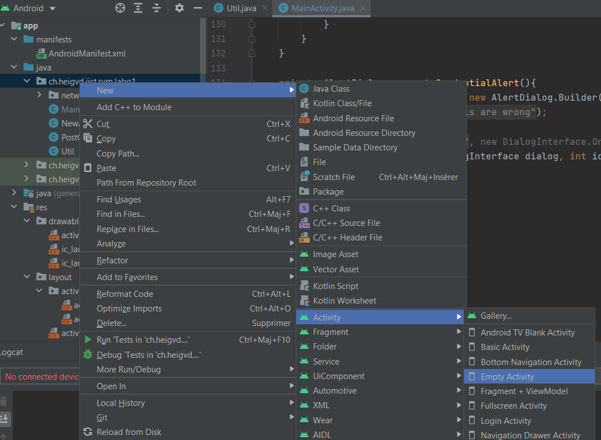
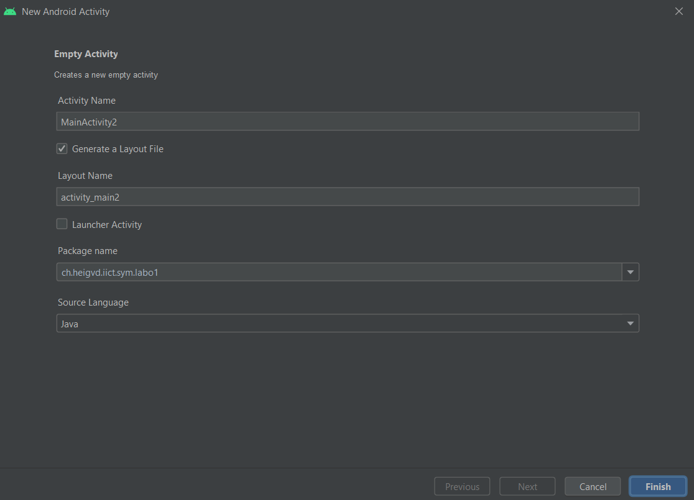

**Auteurs**: Robin Gaudin, Noémie Plancherel, Lev Pozniakoff, Axel Vallon

# SYM: Labo 1 - Introduction à Android 

Vous trouverez ci-dessous les réponses au questions:

## Table des matières

[TOC]

## 2. Premières constations

### 2.1: Langue de l'interface

> Quel est l’intérêt de regrouper les chaînes de caractères dans un fichier XML indépendant à côté des layouts. Vous expliquerez également comment organiser les textes pour obtenir une application multi-langues (français, allemand, italien, langue par défaut : anglais) ? Que se passe-t-il si une traduction est manquante dans la langue par défaut ou dans une langue additionnelle ?

Nous pouvons d'abord voir que les chaînes de caractères sont stockées séparément dans un fichier ``strings.xml``. L'intérêt de cette construction est que la traduction en est simplifiée. En effet, il suffit de faire un clic droit sur le fichier et d'aller sur ``Open translation editor`` pour faire une traduction des chaînes de caractères:



Ceci va ouvrir l'éditeur sous cette forme:



Dans un premier temps il faut cliquer sur le bouton 1, choisir une langue, et ensuite définir une traduction pour chacun des champs. dans la colonne nouvellement créée (2). Ceci va générer un deuxième fichier avec les traductions que vous aurez fourni. L'application va ensuite être automatiquement dans la langue du système si celle-ci est disponible dans cette langue. 

Dans le cas où l'application ou un champ n'est pas traduit, l'application ira chercher le champ dans la langue par défaut. Par exemple, ci-dessous nous n'avons pas traduit le champ email et c'est le seul qui est en anglais.



### 2.2 Champs textuels de saisie

Pour désactiver la correction automatique, il faut activer l'option:

````xml
android:inputType="textNoSuggestions"
````

Dans les champs concernés (email et mot de passe)

Pour cacher les caractères dans le champ de mot de passe il faut activer:

````xml
android:inputType="textPassword|textNoSuggestions" 
````

Afin d'ajouter 2 options input type, il faut les concaténer avec un ``|`` entre les 2 options.

### 2.3 Mode paysage

Le mode paysage nécessite de créer une seconde vue pour l'activité principale. Pour se faire, il faut d'abords se rendre sur la vue portrait existante:



Cliquer sur l'icône 1 puis sur Landscape. Ceci va créer une seconde vue paysage pour l'activité où il faudra replacer les layouts pour qu'ils correspondent à nos attentes de la vue paysage. Ceci fait, android gèrera automatiquement le passage à la vue paysage ou portrait en choisissant le bon xml.

## 3. Gestion des événements et mise à jour de l’interface utilisateur

### 3.1. Vérification du format de l’e-mail

Pour vérifier le format de l'email. Nous avons d'abord créer une classe ``Util`` dans laquelle nous avons créé une fonction ``isValidAddress``. Celle ci va vérifier que l'email tapé a bien le bon format en utilisant un regex. En l'occurence, 

```
"^[a-zA-Z0-9_+&*-]+(?:\\." + "[a-zA-Z0-9_+&*-]+)*@" + "(?:[a-zA-Z0-9-]+\\.)+[a-z" + "A-Z]{2,7}$"
```

Dans le cadre de l'affichage du *Toast*. Nous avons ajouté dans la classe ``Util`` une fonction ``displayInvalidAddressToast``. Celle-ci va recevoir:

- **activity**: L'activité dans laquelle afficher le toast
- **toastText**: Le texte à afficher

Ensuite les lignes suivantes créeront le toast et l'afficheront pendant la durée ``Toast.LENGTH_SHORT`` (environ 2 sec)

````java
Toast toast = Toast.makeText(activity, toastText, Toast.LENGTH_SHORT);
toast.show();
````

Le texte dans le cadre du toast de cette partie est défini dans le string.xml.

### 3.2. Vérification du couple e-mail / mot de passe

Pour la vérification du couple email mot de passe, une simple boucle va parcourir la liste afin de chercher l'adresse mail dans les couples. Si nous la trouvons, nous vérifions si le mot de passe entré correspond. 

En cas de non correspondance. Un pop-up d'erreur s'affichera grâce à la fonction privé ``generateCredentialAlert`` de la classe ``MainActivity``. Ceci passe par la création d'un ``AlertDialog`` via un builder. Celui-ci contiendra un texte défini dans le fichier string.xml cité précédemment. Celui-ci devra contenir un bouton ok pour le fermer donc nous utilisons la fonction ``setPositiveButton`` qui fermera la fenêtre de dialogue. La fonction va enfin créer la fenêtre et la fonction appelante (``onCreate``) va l'afficher.

## 4. Passage à une autre activité

### 4.1. Création et lancement de la nouvelle activité

Android studio fourni des outils qui simplifie la création d'activité.



Pour se faire, un simple clique droit sur le dossier source puis: New -> Activity -> Empty Activity (dans notre cas). 

 

Ceci ouvre la fenêtre ci-dessus qui créera une activité et une vue. La première est ajoutée au dossier java, la deuxième dans le dossier layout des ressources. 

Pour l'instant nous laissons cette activité vide. 

Pour la lancer depuis la MainActivity (une fois la validation d'email effectuée):

````java
Intent switchActivityIntent = new Intent(this, PostCoActivity.class); 
startActivity(switchActivityIntent);
````

Les lignes ci-dessus crée une Intent pour la nouvelle activité et la lance depuis la MainActivity.

### 4.2. Passage de paramètres à la nouvelle activité

Entre les 2 lignes qui permettent de lancer une activité. Il faut ajouter un extra à l'Intent pour passer des données d'une activité à l'autre:

````java
Intent switchActivityIntent = new Intent(this, PostCoActivity.class);
switchActivityIntent.putExtra("account", emailInput);
startActivity(switchActivityIntent);
````

Ceci va ajouter un couple <account, email> qui sera accessible à la 2e activité avec:

````java
String email = extras.getString("account");
````

La donnée passée est accessible via la clé "account", ici codée en dur. Il serait intéressant d'envisager d'ajouter un fichier contenant les clés importantes de l'application afin d'éviter le hardcode.

### 4.3. Permissions simples

